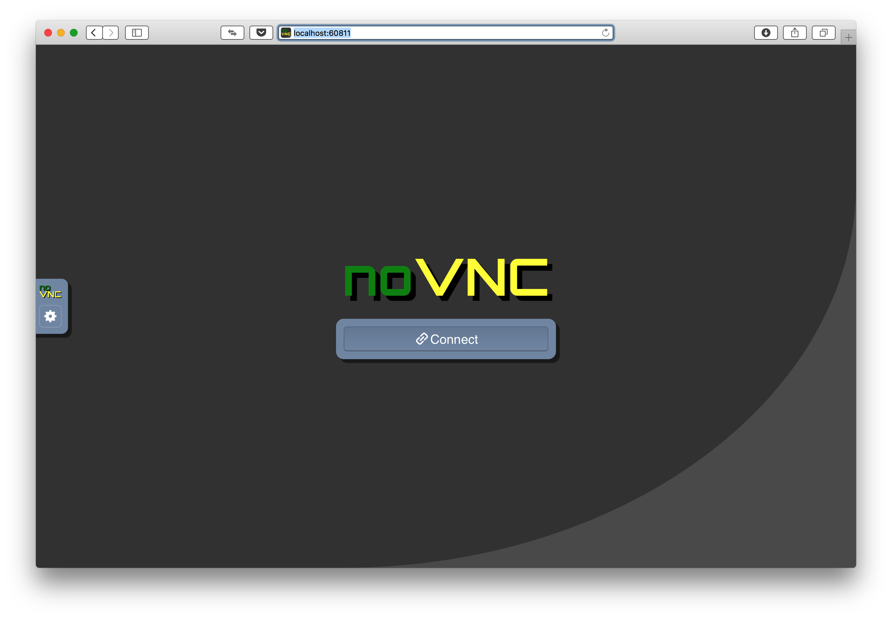
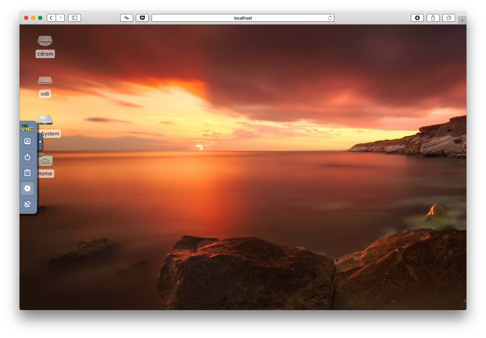
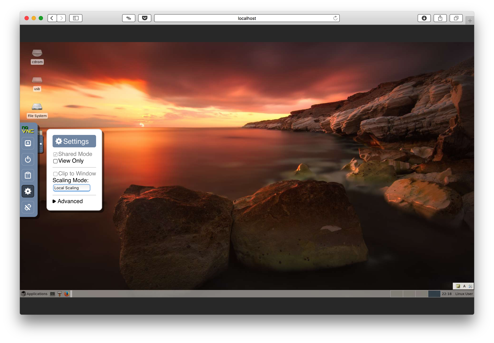
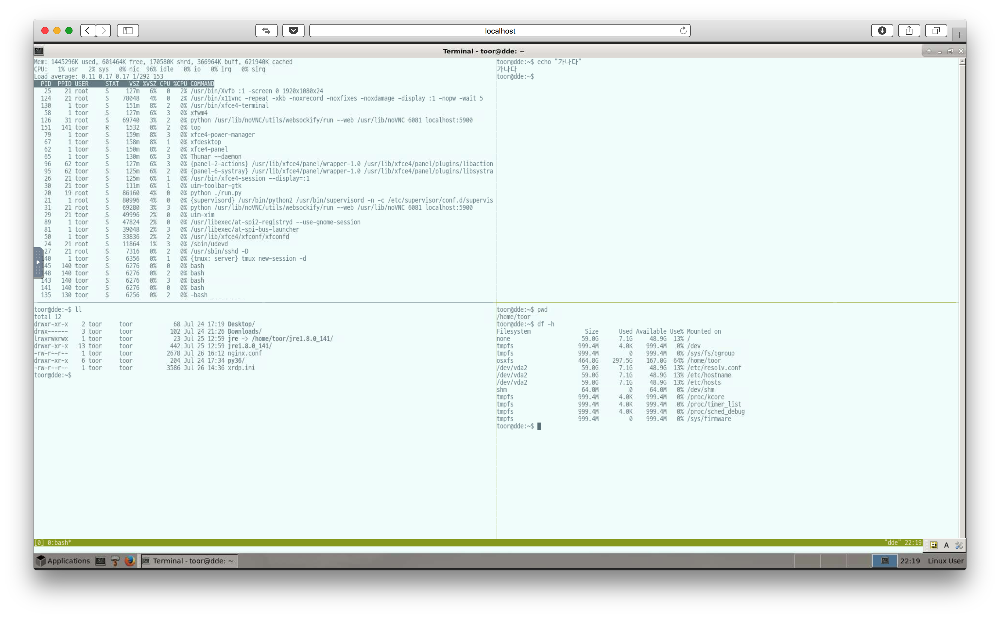
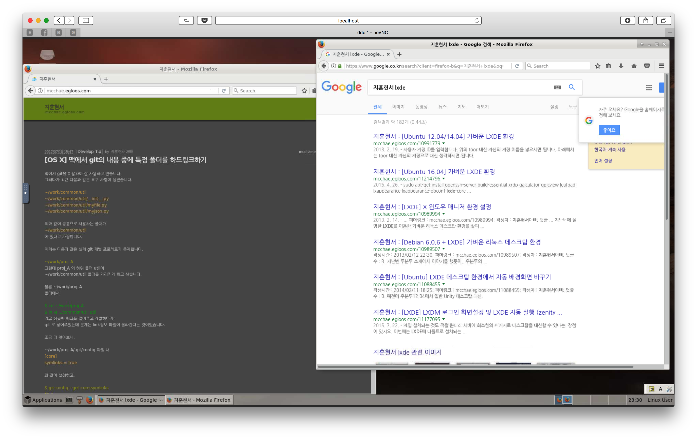
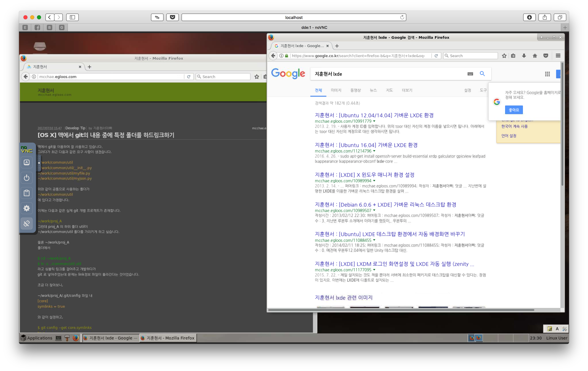
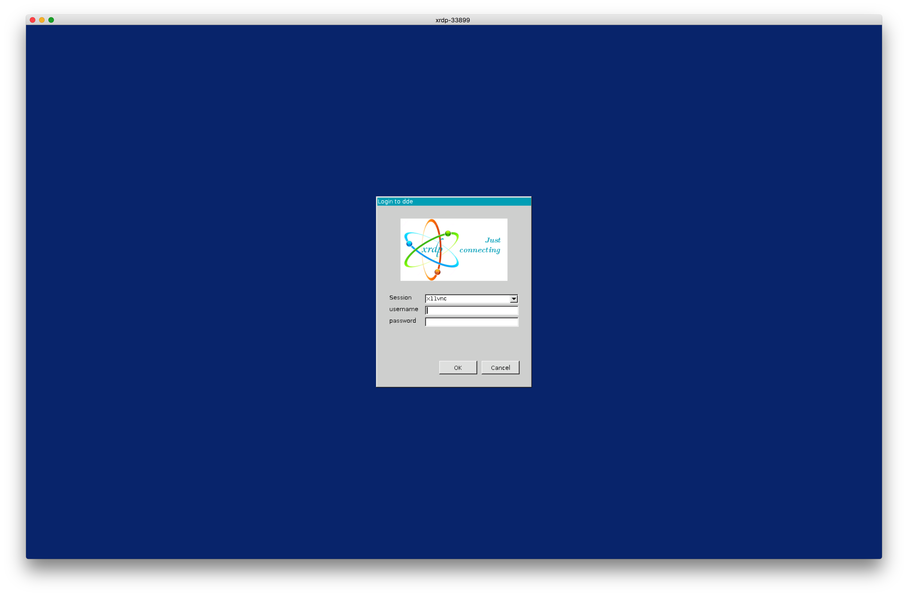
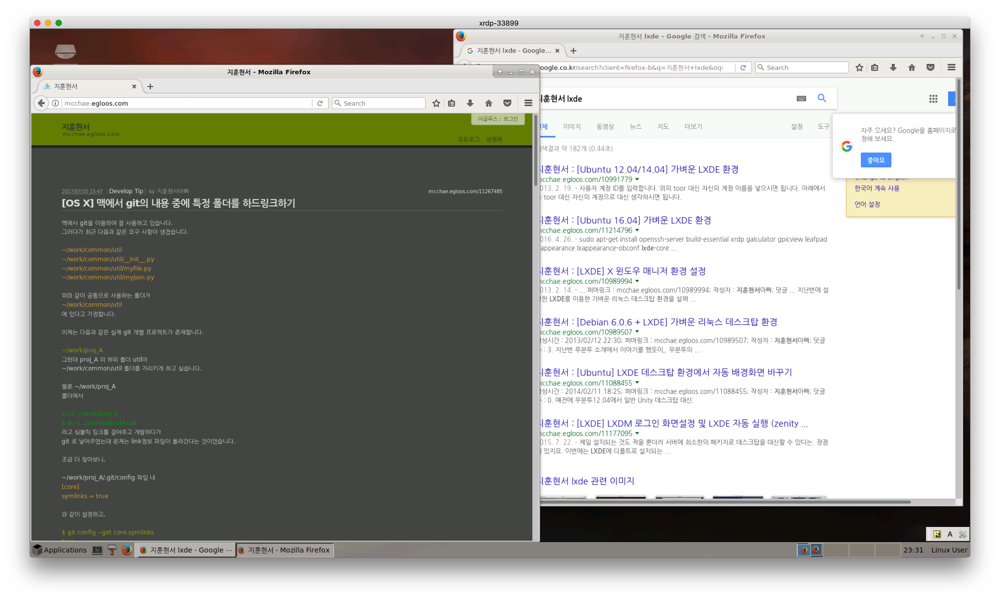

#  목적

며칠 전 [우분투 서버를 이용한 커스텀 ISO 만들기](https://github.com/mcchae/vbuntu-custom-ubuntu-iso)를 올렸었는데 실은 한 일주일 동안 씨름을 하면서 시도해 보았던 것이 있습니다. 솔직히는 한 일년 전부터 시도를 해 보다가 제대로 성공을 못하고 놔두었던 문제이기도 했습니다.

우선 다커를 사용하는 목적에 대하여 정확히 이해해 보기로 합니다.

제일 쉽게 이해할 수 있는 것은 `경량 VM` 입니다. 기존에 HW부터 모두 소프트웨어로 동작하는 VM은 너무 무겁다는 단점이 존재합니다. 하지만 docker를 이용하면 동일한 기능을 하는 Host 같은 동작을 더 가볍게 만들어 돌릴 수 있다는 장점이 있습니다.

그리고 Docker는 어디까지나 사용자가 직접 UI를 입력할 수 있는 환경이라기 보다는 서버를 위한 구성이 더 맞습니다. 따라서 파이썬이나 Go, Java, NodeJS 등으로 구현한 Backend 시스템을 Docker로 개발, 구현, 테스트 등을 모두 한 다음 배포 등을 해 놓은 DevOps와 딱 맞는 것이라 할 수 있습니다.

위의 모든 사이클을 모두 Docker로 하고 싶다는 생각이 2015년 부터 들어 제일 간단하게는 Firefox 웹 브라우저 만이라도 X윈도우 환경의 docker 컨테이너로 돌릴 수 있을까 시도를 했었습니다. 그 당시 누군가가 시도 했었던 것을 따라 해 보고는 했는데 어려움이 많아 하두번 시도하다가 그냥 두었던 것이 기억납니다.

그러다가 다시 최근에 혹시 가벼운 개뱔환경 관련되어 작업된 것이 있을까 살펴보게 되었습니다. 그 결과 다음과 같은 것들을 찾을 수 있었습니다.

* [ubuntu-desktop-lxde-vnc](https://hub.docker.com/r/dorowu/ubuntu-desktop-lxde-vnc/) : 제목에서 유추해 보듯이 제가 만들었던 것과 거의 동일한 작업을 한 것으로 보입니다. (해당 소스의 Dockerfile과 자체 복사하는 파일을 분석하면 작업한 결과를 유추해 볼 수 있습니다) 이 작업을 살펴보았는데 일단 가능성을 타진해 보았습니다. 하나 새롭게 안 사실은 `noVNC`([해당 설명 블로그](http://drt0927.tistory.com/6)) 라는 것을 이용하면 vnc를 통해 다른 VNC 클라이언트나 원격 데스크탑 등이 없어도 작업이 가능하다는 것이었습니다. 만약 아이패드 등을 가지고 있다고 해도 아무 프로그램없이 웹 브라우져 만으로 원격 데스크탑 처럼 연결할 수 있다는 것은 큰 장점을 가진다고 볼 수 있겠더군요. 그런데 받아온 해당 이미지의 크기를 살펴보았습니다.  `1.23GB`를 차지 하였습니다. 물론 VM을 최소한으로 설치해도 이 정도는 나오므로 꽤 쓸만 하다고 볼 수도 있으나 어딘지 모르게 VM스러운 크기라 할 수 있었습니다.
* docker의 크기를 줄이는 것에 대해 왜 중요한지 다시 생각해보면 우분투 서버를 받아 돌이면 작게는 500, 600 메가 바이트 정도에 그 위에 올라가는 프로그램 이미지 들은 그대로 추가되게 됩니다. 하지만 우분투 대신 알파인 리눅스 이미지를 베이스로 하였다면 3.5 메가 바이트에서 출발하게 됩니다. 극단적으로 리눅스 박스가 3.5 메가 바이트로 돌고 있고 그 위에 필요한 것들이 설치되면 됩니다. 예를 들어 파이썬 2나 3을 알파인 리눅스 위에 설치를 하면 약 80 메가바이트 정도 소요하게 됩니다. [Docker Hub의 파이썬 사이트](https://hub.docker.com/_/python/)를 확인해보면 [3.6.2-alpine3.6](https://github.com/docker-library/python/blob/5d86c858d58f84b8dd1274ac61ac1c9c9ebc7739/3.6/alpine3.6/Dockerfile)와 같이 alpine linux 3.6 을 기본으로 하고 그 위에 파이썬 3.6을 설치해 놓은 것을 확인할 수 있습니다. 별도의 물리적 서버이거나 단독의 VM이라면 모든 서비스가 돌아가고 있는, 우분투, CentOS 등과 같은 리눅스가 필요할 수 있으나 docker에서라면 이 양상이 달라집니다. 예를 들어 mysql 서버가 돌아가고 있는 docker 컨터이너에서는 mysqld 서비스만 실제 잘 돌고 있고 해당 3306 포트만 외부로 노출되어 있다면 아무 ㅇ상없이 해당 서비스가 잘 실행되고 있습니다. 이런 상황에서는 우분투, CentOS와 같은 Fully 리눅스 보다는 최소한의 Embeded 시스템과 같은 [alpine linux](https://alpinelinux.org)를 이용하여 해당 이미지를 보다 작게 만들어 놓는 것이 docker host에서 최대의 컨테이너를 싣는 방법이라 할 수 있겠습니다.
* 그래서 찾아본 것이 alpine linux에서 출발한 위와 같은 X윈도우 환경이 있는가 살펴보았습니다.  그렇게 찾은 것이 [docker-xfce4-xrdp](https://github.com/danielguerra69/alpine-xfce4-xrdp) 되겠습니다. 위에 우분투 기반의 1.28MB 대신 588MB 정도 였습니다. 윈도우도 아무리 최소한 설치해도 그 정도 좀 넘지 않겠습니까? 물론 [Tiny Core Linux](http://tinycorelinux.net) 라고 하여 이 머신을 설치하면 X윈도우 환경이 VM에서 띄워도 100 메가 바이트에 불과하기는 하지만 다시 윈도우 매니저와 로컬라이즈 등등을 하다보면 다시 늘어날 것으로 보입니다.  그래서 위와 같은 것들을 기본으로 작업에 들어갔습니다.

## 작업 내용

* Asia/Seoul 타임존 설정
* 한글 입력 환경 (터미널, FireFox 등)
* [xfce 환경](http://mcchae.egloos.com/10935938)
* built-in [tmux 환경](http://mcchae.egloos.com/11246020) (tmux를 이용하면 ssh 등을 연결한 터미널 환경에서 자신이 작업했던 터미널 환경을 그대로 재사용하거나 다른 사람과 화면을 공유하면서 확인해 볼 수 있는 장점이 생기더군요)
* 배경화면이 1시간 마다 자동 변경됨
* 키 자동 반복이 안되는 것을 해결하였습니다.
* 로그아웃 기능이 안되는 것을 수정해 놓았습니다.
* Xface의 디폴트 패널을 LXDE의 것과 최대한 유사하게 만들어 놓았습니다. (하단 1개의 패널)
* 터미널의 배경 색이 새로 뜰 때마다 변경됩니다. (Xfce-Terminal의 디폴트 속성입니다)
* Firefox 웹브라우저를 설치했습니다. 

또한 외부에서 접속할 수 있게 작업된 프로토콜(서비스) 입니다. 필요한 포트만 호스트 포트로 remap 시키면 되겠습니다.

* `ssh`[22] : 원격 접속이 가능하게 되어 있습니다. 터미널 접속이나 포트 터널링 등이 가능합니다.
* `rdp`[3393] : 원래 윈도우에서는 원격데스크탑, Linux에서는 VNC 로 화면 공유를 하고는 했었지요. 그런데 VNC 대비 RDP가 압축 및 속도 등에서 좀 더 우위를 보였었습니다. 그리고 윈도우에 기본으로 원격 데스크탑 클라이언트 프로그램이 설치되어 있다는 것도 장점이 될 수 있지요. 그래서 xrdp 라는 것을 리눅스에 설치하면 VNC 환경 위에 RDP 환경을 이용할 수 있게 Wrapping 시키는 역할을 합니다.
* `noVNC`[6081] : 위의 XRDP와 아주 유사하게 VNC위에 약간의 작업을 하여 웹브라우저의 HTML5 컨트롤과 통신을 하여 원격 데스크탑을 볼 수 있게 만들어 준 것입니다. 처음 이 솔루션을 확인하고는 약간 쇼킹하였습니다. 웹브라우저 만을 이용하여 모든 것이 동일하게 잘 동작하는 것을 확인하고는 말이지요.


## 사용법

### docker 이용

```bash
# 내 데스크탑 이름
MYDT=rdp
# docker host에서 사용할 RDP 포트
HP_RDP=33899
# docker host에서 사용할 noVNC 포트
HP_NOVNC=60811
docker container run -it \
	--name $MYDT \
	--hostname $MYDT \
	-p $HP_RDP:3389 \
	-p $HP_NOVNC:6081 \
	-v /dhv/xfce/toor:/home/toor \
	mcchae/xfce
```

> `-it` 대신 `-d` 옵션을 이용하면 백그라운드 서비스로 실행됩니다.

### docker compose 이용

`~/mydt.yml` 이라는 이름으로 다음의 내용을 저장합니다.

``` yaml
version: '2'
services:
  mydt:
    image: "mcchae/xfce"
    hostname: "mydt"
    environment:
      VNC_GEOMETRY: "1440x900"
    ports:
     - "33899:3389"
     - "60811:6081"
    volumes:
     - ${HOME}/dhv/toor:/home/toor
     - ${HOME}/work:/home/toor/work
```

> * `VNC_GEOMETRY` 환경변수는 해상도를 지정합니다. xrdp 또는 noVNC 모두 적용됩니다. (위의 예에서는 1440x900 해상도로 지정하였습니다)
> * `3389` 포트는 외부로 노출될 원격데스크탑 포트입니다. (위의 예에서는 33899 포트로 접근 가능합니다)
> * `6081` 포트는 외부로 노출될 noVNC 포트입니다. (위의 예에서는 60811 포트로 접근 가능합니다)
> * docker를 돌리는 호스트에 `$HOME/dhv`라는 폴더가 있고 이 폴더에 있는 `toor` 디렉터리가 docker 컨테이너의 `/home/toor` 디렉터리로 볼륨 마운트되어 toor 홈 폴더는 영속성을 갖습니다
> * `$HOME/work` 라는 폴더에 모든 프로젝트가 있고 작업을 하는데 이것이 컨테이너의 `/home/toor/work`로 볼륨 마운트되어 프로젝트 작업을 합니다


그 다음, 다음과 같이 실행합니다.

```sh
$ docker-compose -f ~/mydt.yml up
```

> * `-d` 옵션을 이용하면 백그라운드 서비스로 실행됩니다.
> * `docker-compose -f ~/mydt.yml logs` 명령으로 컨테이너의 로그를 확인합니다. (특별히 -d 로 up 하였을 경우)
> * `docker-compose -f ~/mydt.yml down` 명령으로 컨테이너를 내립니다.


## 실행 예

다음은 실행한 화면입니다.

### 웹 브라우저로 noVNC 접속

웹 브라우저에서 `localhost:60811` 로 접속해 보면,


위와 같이 noVNC 연결을 위한 화면이 나타납니다. 가운데 `connect`를 누릅니다.


처음 로그인하면 화면이 모두 안 보일 수 있습니다.


좌측의 설정을 눌러 `scaling mode`를 `local scaling`으로 변경합니다. 그러면 화면을 조종하면서 자신의 브라우저의 비율을 조종하면 됩니다. (해당 설정은 로컬에 저장됩니다)


TMUX 환경으로 실행해 본 것입니다.


Firfox 환경입니다.


사용하지 않을 경우 왼쪽 noVNC의 `disconnect`를 눌러 연결을 끊습니다. 다음에 다시 연결하면 마지막 작업했던 환경으로 되돌아 갑니다.

### 원격 데스크탑으로 연결


이제는 원격 데스크탑으로 연결합니다. `toor`사용자에 암호는 `r`입니다. 

> 보안이 중요한 환경에서는 꼭 암호를 설정해 주시기 바랍니다.


원격 데스크탑으로 연결하여도 noVNC와 연결했던 것과 동일한 화면으로 되돌아 갑니다. 아하. 결국 내부적으로는 VNC 연결을 열어놓고 이를 동일하게 noVNC 또는 XRDP로 체인징 해 준다고 이해 됩니다.


# 결론

위와 같이 결국은 가벼운 데스크탑을 Docker로 구현해 보았습니다. 그 쓰임새 및 이용은 기대 이상일 것으로 상상됩니다.

어느 분께는 도움이 되셨기를...

